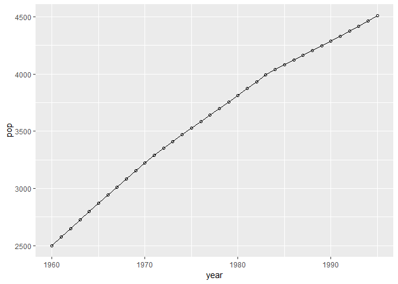

Homework 5
================
Carlisha Hall
March 5, 2019

Homework Question 23
--------------------

### <https://github.com/bzantium/time-series-analysis>

### Chapter 2 R. exercise 2.1

``` r
#https://github.com/bzantium/time-series-analysis
#Chapter 2 R. exercise

#Aquired the following packages
suppressMessages(library(lubridate, warn.conflicts = FALSE, quietly=TRUE))
suppressMessages(library(ggplot2, warn.conflicts = FALSE, quietly=TRUE))
suppressMessages(library(car, warn.conflicts = FALSE, quietly=TRUE))
suppressMessages(library(forecast, warn.conflicts = FALSE, quietly=TRUE))

# Example 2.1
setwd("C:/Users/Carlisha Hall/Desktop/es2019hw5/timedata")
# read in population data 
data <- read.csv('../timedata/population.txt', sep='', header=FALSE) 
#pop is assigned the data from the read.csv file
pop <- na.omit(c(t(data)))
#values in pop was rounded 4 dec. places 
pop <- round(pop/10000)
#ln pop was assigned the log of the values in pop
lnpop <- log(pop)
# lists the length of elements in pop 
t <- 1:length(pop)
# t raised to the 2nd power
t2 <- t**2
# created list of years that coincide with the population data
year <- 1959 + t
#data frame containing objects pop, lnpop, t, t2, year
df1 <- data.frame(pop, lnpop, t, t2, year)
data2<-ggplot(data=df1, aes(year, pop)) + 
  geom_line() + 
  geom_point(shape=1, color='black') #changed shape from 1 to 8
data2
```



``` r
#regression model of population data (pop is the outcome variable and t is the independent, variable) 
regmodel <- lm(pop~t, data=df1) 
#anova test
anova(regmodel)
```

    ## Analysis of Variance Table
    ## 
    ## Response: pop
    ##           Df   Sum Sq  Mean Sq F value    Pr(>F)    
    ## t          1 12628351 12628351  3644.2 < 2.2e-16 ***
    ## Residuals 34   117822     3465                      
    ## ---
    ## Signif. codes:  0 '***' 0.001 '**' 0.01 '*' 0.05 '.' 0.1 ' ' 1

``` r
#summary of liner regression model 
summary(regmodel)
```

    ## 
    ## Call:
    ## lm(formula = pop ~ t, data = df1)
    ## 
    ## Residuals:
    ##     Min      1Q  Median      3Q     Max 
    ## -115.40  -48.30   16.87   54.37   63.29 
    ## 
    ## Coefficients:
    ##              Estimate Std. Error t value Pr(>|t|)    
    ## (Intercept) 2559.3889    20.0385  127.72   <2e-16 ***
    ## t             57.0135     0.9444   60.37   <2e-16 ***
    ## ---
    ## Signif. codes:  0 '***' 0.001 '**' 0.01 '*' 0.05 '.' 0.1 ' ' 1
    ## 
    ## Residual standard error: 58.87 on 34 degrees of freedom
    ## Multiple R-squared:  0.9908, Adjusted R-squared:  0.9905 
    ## F-statistic:  3644 on 1 and 34 DF,  p-value: < 2.2e-16
